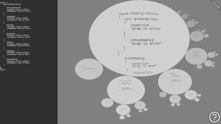

# atomizer

*Atomizer* is an s-expression visualization tool.

## about the project

In computer programming, an [S-expression](https://en.wikipedia.org/wiki/S-expression) (or symbolic expression, abbreviated as sexpr or sexp) is an expression in a like-named notation for nested list (tree-structured) data. S-expressions were invented for and popularized by the programming language Lisp, which uses them for source code as well as data. *Atomizer* graphically displays S-expressions in an interactive, fractally structured system of ovals.

## application specifics

The application is consisted of two panes. Left pane resembles input prompt for entering S-expressions. Multiline input is obtained by holding `shift` while hitting `enter`. Standard pasting S-expressions from clipboard should also work fine. History of previously entered S-expressions is accessed by pressing up and down arrows. On hitting `enter` on its own in the input pane, if valid, inputted S-expression is sent to the right pane visualizer. Refer to built in application instructions for learning about navigating visualizer (the bottom-right questionmark).

## testing the application

Online link for testing the application is [here](https://contrast-zone.github.io/atomizer/).

## installing and running the application

To install *Atomizer*, download this package, unzip it to a folder of your choice, and open included `index.html` from a web browser. There is no build procedure, there are no third party dependencies, and the application should work as it is, even from a local file system.

## licensing information

This project is licenced under [MIT License](LICENSE).
